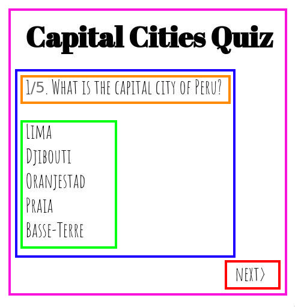
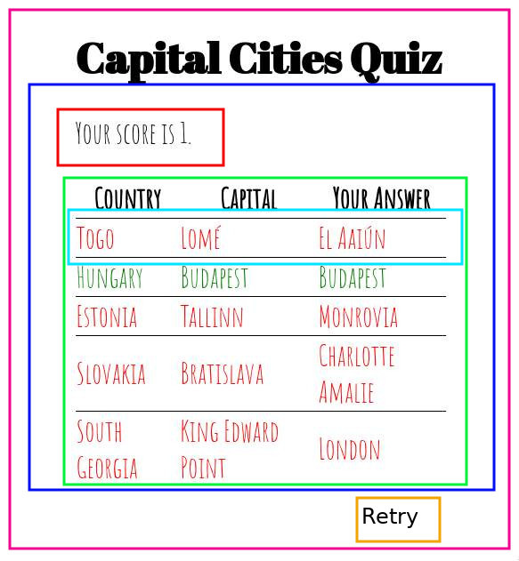

# CountryQuiz - Capital Cities Quiz

## What
This quiz tests the users knowledge of the world's capital cities.

## Running locally
```
git clone git@github.com:dangerdak/countryquiz-react.git
npm run start
```
Then go to `localhost:8080` in your browser.

## Why
To learn React & capital cities

## How

- Quiz (pink)
  - Question (blue)
    - QuestionHeader (orange)
    - SelectAnswer (green)
  - QuestionNavigation (red)


- Quiz (pink)
  - Results (blue)
    - Score (red)
    - Solutions (green)
        - Solution (turquoise)
  - ResultsNavigation (orange)


## Data
- Questions (quiz props)
- Current question number (quiz state)
- Users answers (quiz state, results props)
